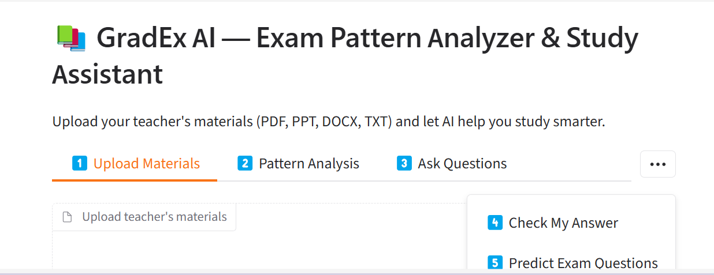
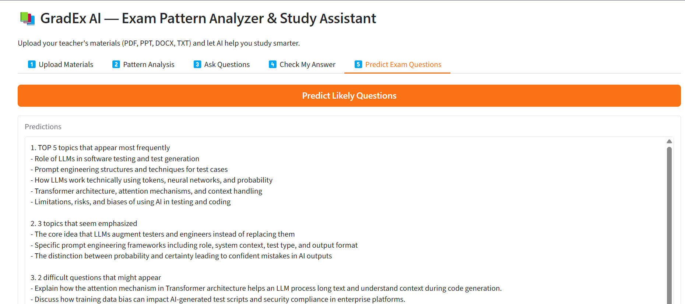

# 📚 GradEx AI

A retrieval-augmented (RAG) study assistant. Upload a teacher's materials (PDF, PPTX, DOCX, TXT) and it will:

- 🔍 **Analyze the teacher's pattern** — recurring topics, keywords, expectations
- 💬 **Answer questions** — grounded strictly in the uploaded materials, with sources cited
- ✅ **Grade a draft answer** — against the teacher's material, with a suggested score
- 🔮 **Predict likely exam questions** — based on what appears most often

Built with **Gemini** (embeddings + generation), **ChromaDB** (vector search), and **Gradio** (UI).

## Screenshots





## Project structure

```
gradex-ai/
├── main.py          # entry point — run this
├── app.py           # Gradio UI
├── config.py        # settings, loaded from .env
├── extractors.py     # PDF/PPTX/DOCX/TXT text extraction + chunking
├── services.py       # Gemini + ChromaDB wrappers
├── core.py           # the 5 features + prompts
├── test_app.py        # a few unit tests
├── requirements.txt
└── .env.example
```

## Setup

1. **Clone and enter the project**
   ```bash
   git clone https://github.com/<your-username>/gradex-ai.git
   cd gradex-ai
   ```

2. **Create a virtual environment**
   ```bash
   python -m venv venv
   source venv/bin/activate      # Windows: venv\Scripts\activate
   ```

3. **Install dependencies**
   ```bash
   pip install -r requirements.txt
   ```

4. **Add your API key**
   ```bash
   cp .env.example .env
   ```
   Then open `.env` and paste your key from [aistudio.google.com/app/apikey](https://aistudio.google.com/app/apikey).

5. **Run**
   ```bash
   python main.py
   ```
   Open the local URL it prints (usually `http://127.0.0.1:7860`).

## Run tests

```bash
pip install pytest
pytest -v
```

## Tech stack

Gemini API · ChromaDB · Gradio · pypdf · python-pptx · python-docx

## License

MIT — see [LICENSE](LICENSE).
